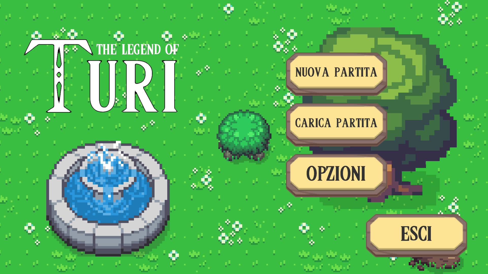
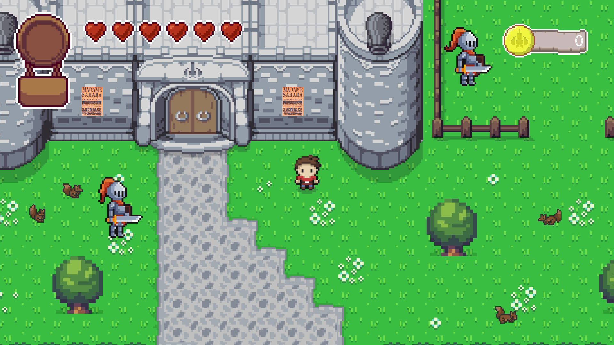
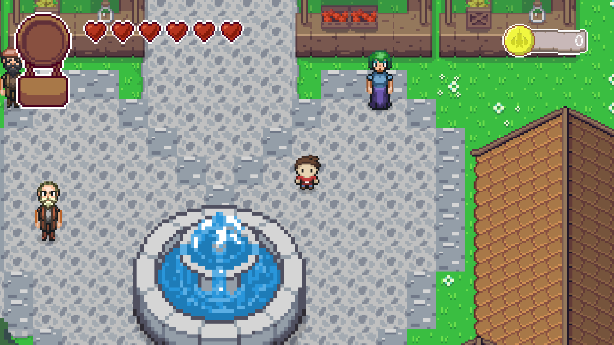
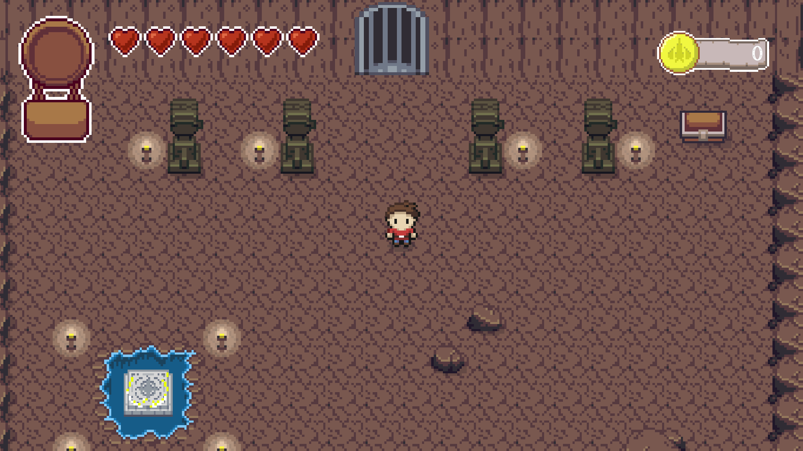

# ⚔️ The Legend of Turi

**Un'avventura top-down in pixel art ispirata ai grandi classici del genere, realizzata con Unity.**

## 🎮 Il gioco

Esplora il regno, parla con i suoi abitanti, affronta mostri e dungeon e scopri cosa si nasconde dietro la missione affidata dalla regina. Un'avventura in stile *Zelda* con dialoghi, quest, negozi, enigmi e un boss finale, il tutto in **italiano**.

### ✨ Caratteristiche

- 🗡️ **Combattimento** con spada e **arco** (con frecce da raccogliere e un cambio arma rapido)
- 👹 **Nemici vari**: slime, tronchi, orchi e scoiattoli, ciascuno con la propria IA
- 👑 **Boss finale** con una vera macchina a stati: fasi di attacco, rabbia, stordimento e invulnerabilità temporanea
- 🏰 **Mondo a stanze** con transizioni fluide, porte, bottoni, forzieri, cartelli e porte che si aprono solo sconfiggendo i nemici
- 📜 **Quest** e **dialoghi** con NPC (cavalieri, mercanti, villici, Madame Sahara…)
- 🛒 **Negozi** con prezzi e scorte, monete, cuori e **porta-cuori** per aumentare la vita
- 🪙 Pozzi dei desideri: lancia una moneta e spera nella fortuna
- 💾 **Salvataggio e caricamento** della partita
- 🎬 Intro, crediti animati, musica ed effetti sonori, impostazioni audio

## 🖼️ Screenshot

| Il castello | La piazza del villaggio |
|:--:|:--:|
|  |  |

| Il dungeon |
|:--:|
|  |

## 📥 Come giocare

Il gioco è già compilato e pronto per **Windows**:

1. Vai alla pagina delle [**Release**](https://github.com/GiuseppeBellamacina/The-Legend-of-Turi/releases/latest)
2. Scarica `Turi.zip` e decomprimilo
3. Avvia l'eseguibile e buon divertimento!

## 🧩 Il codice

Questa repository contiene **solo gli script C#** del progetto (gli asset grafici e audio non sono inclusi).
Qualche spunto su come è organizzato il codice in [Scripts/](Scripts):

| Cartella | Contenuto |
|---|---|
| `Characters/` | Giocatore, NPC e nemici, compreso il boss con i suoi stati (`StateMachineBehaviour`) |
| `Managers/` | Singleton per audio, input, livelli, monete, vita, respawn e flusso di gioco |
| `ScriptableObjects/` | Inventario, oggetti, dialoghi, stati delle quest, valori condivisi e segnali |
| `DataClass/` | Classi serializzabili e `SaveSystem` per salvataggio/caricamento |
| `Quests/` | Sistema di missioni basato su una classe astratta `Quest` |
| `Rooms/` | Gestione delle stanze e dei passaggi tra scene |
| `Objects/` | Oggetti interattivi, collezionabili e proiettili |
| `Menu/`, `Intro_CreditScene/` | Menu, impostazioni, intro e crediti |

Scelte tecniche notevoli:

- 🧠 **Architettura a ScriptableObject**: dati condivisi (`BoolValue`, `IntValue`, `Inventory`…) e **segnali** (`Signals`/`SignalListener`) per far comunicare i sistemi senza dipendenze dirette
- 🎛️ **Nuovo Input System** di Unity per i controlli
- 🔁 Interfacce `IResettable` e `ISaveLoad` per reset di stanza e persistenza dei dati

## 👤 Autore

Sviluppato da **Giuseppe Bellamacina**.
